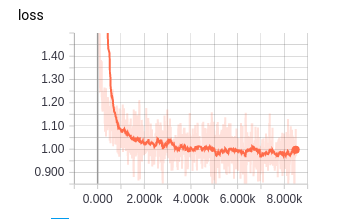

# DnCNN-tensorflow   
[](LICENSE)
[](https://hub.docker.com/r/wenbodut/dncnn/)
[](CONTRIBUTING.md)
  
A tensorflow implement of the TIP2017 paper [Beyond a Gaussian Denoiser: Residual Learning of Deep CNN for Image Denoising](http://www4.comp.polyu.edu.hk/~cslzhang/paper/DnCNN.pdf)

## Model Architecture


## Results


- BSD68 Average Result
 
The average PSNR(dB) results of different methods on the BSD68 dataset.

|  Noise Level | BM3D | WNNM  | EPLL | MLP |  CSF |TNRD  | DnCNN-S | DnCNN-B | DnCNN-tensorflow |
|:-------:|:-------:|:-------:|:-------:|:-------:|:-------:|:-------:|:-------:|:-------:|:-------:|
| 25  |  28.57  |   28.83   | 28.68  | 28.96 |  28.74 |  28.92 | **29.23** | **29.16**  | **29.17** |

- Set12 Average Result


| Noise Level | DnCNN-S | DnCNN-tensorflow |
|:-----------:|:-------:|:----------------:|
| 25          | 30.44   | **30.38**        |

For the dataset and denoised images, please download [here](https://drive.google.com/open?id=16x8E7h0srYQliXbrO0pvX6zogfW1hN2P)


## Environment
### :whale: With docker (recommended):
- Install docker support

You may do it like this(ubuntu):
``` shell
$ sudo apt-get install -y curl
$ curl -sSL https://get.docker.com/ | sh
$ sudo usermod -aG docker ${USER}
```
- Install nvidia-docker support(to make your GPU available to docker containers)

You may do it like this(ubuntu):
```shell
$ wget -P /tmp https://github.com/NVIDIA/nvidia-docker/releases/download/v1.0.1/nvidia-docker_1.0.1-1_amd64.deb
$ sudo dpkg -i /tmp/nvidia-docker*.deb && rm /tmp/nvidia-docker*.deb
```

- Pull dncnn image and start a container
```shell
$ docker pull wenbodut/dncnn
$ ./rundocker.sh
```
Then you could train the model.

### Without docker:
You should make sure the following environment is contented
```
tensorflow == 1.4.1
numpy
```


## One-Key-To-Denoise
```
$ ./oneKeyToDenoise.sh
(need docker support)
```
Then you could find the noisy Set12 images and denoised images in test folder. Have fun!

## Train
```
$ python generate_patches.py
$ python main.py
(note: You can add command line arguments according to the source code, for example
    $ python main.py --batch_size 64 )
```

For the provided model, it took about 4 hours in GTX 1080TI.

Here is my training loss:

**Note**: This loss figure isn't suitable for this trained model any more, but I don't want to update the figure :new_moon_with_face:




## Test
```
$ python main.py --phase test
```

## TODO
- [x] Fix bug #13. (bug #13 fixed, thanks to @sdlpkxd)
- [x] Clean source  code. For instance, merge similar functions(e.g., 'load_images 'and 'load_image' in utils.py).
- [x] Add one-key denoising, with the help of docker.
- [x] Compare with original DnCNN.
- [x] Replace tf.nn with tf.layer.
- [ ] Replace PIL with OpenCV.
- [ ] Try tf.dataset API to speed up training process.
- [ ] Train a noise level blind model.


## Thanks for their contributions
- @lizhiyuanUSTC
- @husqin
- @sdlpkxd
- and so on ...


