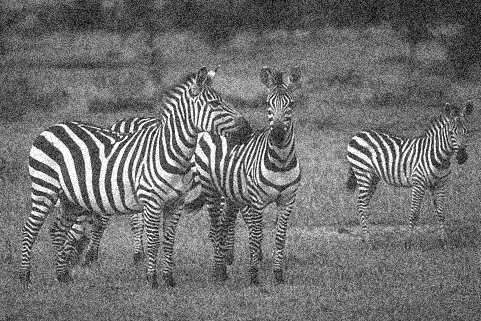
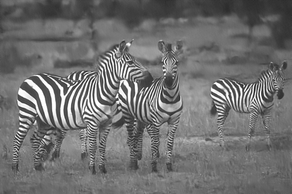

# DnCNN-tensorflow   [](https://opensource.org/licenses/GPL-3.0/)  
a tensorflow implement of the TIP2017 paper [Beyond a Gaussian Denoiser: Residual Learning of Deep CNN for Image Denoising](http://www4.comp.polyu.edu.hk/~cslzhang/paper/DnCNN.pdf)

## Model Architecture


## Results
### Gaussian Denoising
#### GT
 
#### Noisy

#### Denoised


#### BSD68 Average Result 
The average PSNR(dB) results of different methods on the BSD68 dataset.

|  Noise Level | BM3D | WNNM  | EPLL | MLP |  CSF |TNRD  | DnCNN-S | DnCNN-B | DnCNN-tensorflow |
|:-------:|:-------:|:-------:|:-------:|:-------:|:-------:|:-------:|:-------:|:-------:|:-------:|
| 25  |  28.57  |   28.83   | 28.68  | 28.96 |  28.74 |  28.92 | **29.23** | **29.16**  | **29.24** |


## Environment
### With docker (recommended):
0) Install docker, following the instructions on https://docs.docker.com/engine/installation/
1) Install nvidia-docker, to make your GPU available to docker containers
2) Create an image that can run the code from the provided Dockerfile. Call the image 'dncnn':
```
$ docker build --network host -t dncnn .
$ ./rundocker.sh
```
Then you could train the model.

### Without docker:
You should make sure the following environment is contented
```
tensorflow = 1.0.1
numpy
```


## Train
```
$ python generate_patches.py
$ python main.py
(note: You can add command line arguments according to the source code, for example
    $ python main.py --batch_size 64 )
```
Here is my training loss:


 

## Test
```
$ python main.py --phase test
```

## TODO
* Clean source  code. For instance, merge similar functions(e.g., 'load_images 'and 'load_image' in utils.py)
* Replace PIL with OpenCV.
* Fix bugs, such as #13. (bug #13 fixed, thanks to @sdlpkxd)
* Support the newest tensorflow(1.4)

## Thanks for their contributions
* @lizhiyuanUSTC
* @husqin
* @sdlpkxd
* and so on ...


